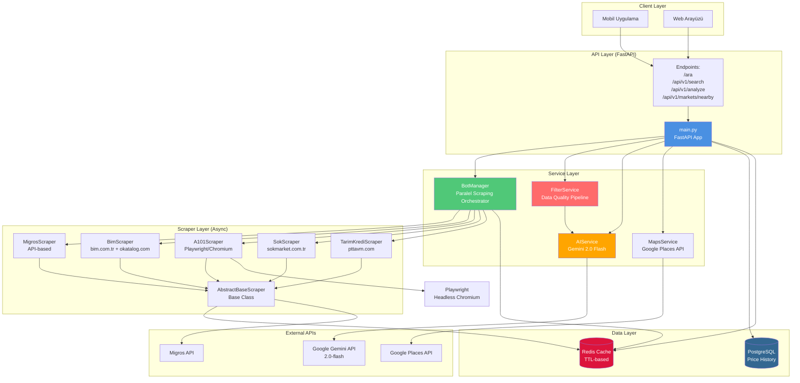
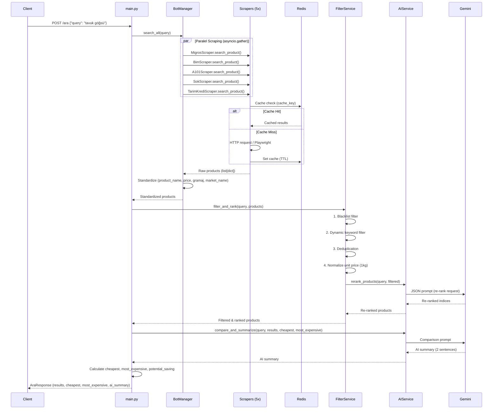

# Maliyet Asistanı - Proje Mimarisi

## 📋 Genel Bakış

**Maliyet Asistanı**, Türkiye'deki büyük market zincirlerinin (Migros, BİM, A101, ŞOK, Tarım Kredi) fiyatlarını anlık tarayan, karşılaştıran ve Gemini AI ile finansal koçluk sunan yüksek performanslı bir FastAPI backend uygulamasıdır.

---

## 🏗️ Mimari Diyagram



---

## 📁 Klasör Yapısı

```
backend/
├── main.py                    # FastAPI entry point, endpoints, lifecycle
├── requirements.txt            # Python dependencies
├── Dockerfile                  # Container image definition
├── docker-compose.yml          # Multi-container orchestration
├── .env                        # Environment variables (API keys, DB URLs)
│
├── models/                     # Data Models & Database
│   ├── __init__.py
│   ├── database.py            # PostgreSQL (SQLAlchemy async), Redis clients
│   └── schemas.py             # Pydantic schemas (request/response), SQLAlchemy ORM models
│
├── scrapers/                   # Market Bot Scrapers (Async)
│   ├── __init__.py
│   ├── base_scraper.py        # AbstractBaseScraper (ABC)
│   ├── migros_bot.py          # Migros API scraper
│   ├── bim_bot.py             # BİM aktüel + okatalog.com fallback
│   ├── a101_bot.py            # A101 Playwright/Chromium browser scraper
│   ├── sok_bot.py             # ŞOK web scraper
│   └── tarimkredi_bot.py      # Tarım Kredi (PttAVM) scraper
│
└── services/                   # Business Logic Services
    ├── __init__.py
    ├── bot_manager.py          # Orchestrates all scrapers (parallel execution)
    ├── filter_service.py       # Data quality pipeline (blacklist, dedup, normalize, AI rerank)
    ├── ai_service.py           # Gemini AI integration (summaries, coaching, reranking)
    └── maps_service.py         # Google Places API (nearby markets)
```

---

## 🔄 Veri Akışı (Data Flow)

### 1. Ürün Arama İsteği (`POST /ara`)



---

## 🧩 Bileşen Detayları

### 1. **FastAPI Application (`main.py`)**

**Rol**: HTTP API katmanı, endpoint tanımları, lifecycle yönetimi

**Endpoints**:
- `GET /health` - Sağlık kontrolü
- `POST /ara` veya `POST /api/v1/ara` - Ana arama endpoint'i
- `POST /api/v1/search` - Ürün arama (legacy)
- `GET /api/v1/history/{product_id}` - Fiyat geçmişi
- `POST /api/v1/analyze` - AI tasarruf analizi
- `GET /api/v1/markets/nearby` - Yakın marketler

**Lifecycle**:
- Startup: PostgreSQL/Redis bağlantıları, servislerin başlatılması
- Shutdown: Tüm bağlantıların temiz kapatılması

---

### 2. **BotManager (`services/bot_manager.py`)**

**Rol**: Tüm market botlarını paralel çalıştıran orkestratör

**Özellikler**:
- `asyncio.gather()` ile 5 botu aynı anda tetikler
- Her bot için 15 saniye timeout (bir bot yavaşsa diğerleri beklenmez)
- Sonuçları standart şablona çeker (`_standardize_product`)
- Hata yönetimi ve logging (hangi marketler yanıt verdi, hangileri başarısız)

**Bot Listesi**:
1. `MigrosScraper` - Migros API
2. `BimScraper` - bim.com.tr aktüel + okatalog.com
3. `A101Scraper` - Playwright/Chromium
4. `SokScraper` - sokmarket.com.tr
5. `TarimKrediScraper` - pttavm.com

---

### 3. **AbstractBaseScraper (`scrapers/base_scraper.py`)**

**Rol**: Tüm botların türediği soyut temel sınıf

**Ortak İşlevler**:
- Redis cache yönetimi (`_get_cached`, `_set_cache`)
- HTTP istekleri (`httpx.AsyncClient`, retry logic, rate-limiting)
- Gerçekçi tarayıcı header'ları (User-Agent, Accept, vb.)
- Hata yönetimi ve logging

**Abstract Methods**:
- `search_product(query: str) -> list[dict]` - Ürün arama
- `get_product_price(product_id: str) -> dict | None` - Tek ürün fiyatı

---

### 4. **FilterService (`services/filter_service.py`)**

**Rol**: Veri kalitesi pipeline'ı (5 aşamalı)

**Pipeline Sırası**:
1. **Blacklist Filter**: Alakasız ürünleri eler (ped, noodle, deterjan, vb.)
2. **Dynamic Keyword Filter**: Sorguya göre zorunlu kelimeler kontrol eder
   - Örnek: "tavuk göğsü" → ürün adında "tavuk" veya "bonfile" geçmeli
3. **Deduplication**: `(product_name, market_name)` çiftine göre tekilleştirme
4. **Normalize Unit Price**: Gramaj varsa `normalized_price_per_kg` hesaplar
   - 500g ürün → fiyat * 2 = 1kg fiyat
5. **AI Re-Ranking**: Gemini'ye gönderir, alakasızları çıkarır, 1kg fiyatına göre sıralar

---

### 5. **AIService (`services/ai_service.py`)**

**Rol**: Google Gemini 2.0 Flash entegrasyonu

**Fonksiyonlar**:
- `compare_and_summarize()` - Fiyat karşılaştırma özeti (2 cümle)
- `analyze_savings()` - Tasarruf analizi
- `investment_coaching()` - Yatırım önerileri
- `rerank_products()` - Ürün listesini AI ile yeniden sıralama

**Hata Yönetimi**:
- Quota exceeded → Fallback summary (veri tabanlı)
- API hatası → Graceful degradation

---

### 6. **MapsService (`services/maps_service.py`)**

**Rol**: Google Places API ile yakın market bulma

**Fonksiyonlar**:
- `find_nearby_markets(lat, lng, radius_km)` - Konum bazlı market arama
- Haversine formülü ile mesafe hesaplama

---

## 🗄️ Veritabanı Şeması

### PostgreSQL (SQLAlchemy ORM)

```python
# models/schemas.py

class Market(Base):
    id: int
    name: str  # "Migros", "BIM", "A101", vb.
    chain_id: str

class Product(Base):
    id: int
    name: str
    barcode: str | None
    category: str | None

class Price(Base):
    id: int
    product_id: int (FK → Product)
    market_id: int (FK → Market)
    price: float
    currency: str = "TRY"
    recorded_at: datetime
```

**Not**: Şu an PostgreSQL şeması tanımlı ancak aktif kullanımda değil. Gelecekte fiyat geçmişi için kullanılacak.

---

### Redis Cache

**Key Format**: `scraper:{MARKET_NAME}:{cache_key}`

**Örnek**:
- `scraper:Migros:search:tavuk göğsü`
- `scraper:A101:search:pirinç`

**TTL**: Her bot için farklı (varsayılan: 3600 saniye = 1 saat)

---

## 🐳 Docker Mimarisi

### Container Yapısı

```yaml
services:
  app:              # FastAPI uygulaması
    - Python 3.12
    - Playwright + Chromium
    - Port: 8000

  postgres:         # PostgreSQL 16
    - Port: 5432
    - Volume: postgres_data

  redis:            # Redis 7
    - Port: 6379
    - Volume: redis_data
```

### Özellikler:
- **SELinux Uyumluluğu**: Fedora için `:z` volume flag
- **Shared Memory**: Chromium için `shm_size: 2gb`
- **Health Checks**: PostgreSQL ve Redis için
- **Auto-restart**: `unless-stopped`

---

## ⚡ Performans Özellikleri

### Paralel İşleme
- **5 bot paralel çalışır** (`asyncio.gather`)
- **Timeout**: Her bot için 15 saniye (yavaş bot diğerlerini bloklamaz)
- **Cache**: Redis ile tekrar isteklerde hızlı yanıt

### Ölçeklenebilirlik
- **Async/Await**: Non-blocking I/O
- **Connection Pooling**: httpx ve asyncpg
- **Rate Limiting**: BaseScraper'da semaphore ile

---

## 🔐 Güvenlik

- **API Keys**: `.env` dosyasında (git'e commit edilmez)
- **CORS**: Şu an `allow_origins=["*"]` (prod'da sınırlandırılmalı)
- **User-Agent**: Gerçekçi tarayıcı header'ları (bot detection önleme)
- **Error Handling**: Hassas bilgiler loglarda görünmez

---

## 📊 Örnek Veri Akışı

### Input:
```json
POST /ara
{
  "query": "tavuk göğsü",
  "latitude": 41.0082,
  "longitude": 28.9784,
  "radius_km": 5
}
```

### Output:
```json
{
  "query": "tavuk göğsü",
  "results": [
    {
      "product_name": "Banvit Piliç Bonfile Kg",
      "price": 189.95,
      "gramaj": null,
      "normalized_price_per_kg": null,
      "market_name": "Migros",
      "currency": "TRY"
    },
    ...
  ],
  "cheapest": {...},
  "most_expensive": {...},
  "potential_saving": 1389.1,
  "ai_summary": "En ucuz tavuk göğsü ŞOK marketinde..."
}
```

---

## 🚀 Gelecek Geliştirmeler

1. **PostgreSQL Entegrasyonu**: Fiyat geçmişi kaydetme ve analiz
2. **Rate Limiting**: API endpoint'lerinde throttling
3. **Monitoring**: Prometheus/Grafana metrikleri
4. **WebSocket**: Real-time fiyat güncellemeleri
5. **GraphQL**: Daha esnek sorgulama

---

**Son Güncelleme**: 2026-02-10
**Versiyon**: 1.0.0
