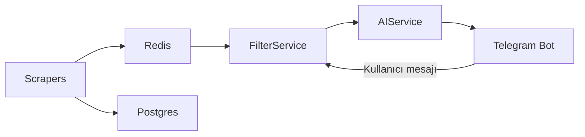

# Akıllı Market Fiyat Asistanı (Gemini 2.5 Flash Destekli)

Birden fazla marketten (Migros, A101, ŞOK, Tarım Kredi) anlık fiyat çeken, birim fiyat hesaplayan ve **Gemini AI** ile kullanıcılara alışveriş tavsiyesi veren bir Telegram botu.

---

## Öne Çıkan Özellikler

- **Gemini 2.5 Flash entegrasyonu** – Alışveriş özeti ve birim fiyat tavsiyeleri
- **Docker altyapısı** – Redis (önbellek) ve PostgreSQL ile tek komutla ayağa kalkar
- **Otomatik birim fiyat normalizasyonu** – Gramaj / litre bazında karşılaştırma
- **Fallback mekanizması** – API veya kota hatalarında statik tavsiye veya veri odaklı özet

---

## Teknoloji Yığını

| Katman        | Teknoloji           |
|---------------|----------------------|
| Dil           | Python               |
| Bot           | Telegram Bot API     |
| AI            | Google Gemini API    |
| Veritabanı    | PostgreSQL (async)   |
| Önbellek     | Redis                |
| Konteyner     | Docker / Docker Compose |

---

## Kurulum

### Gereksinimler

- Docker ve Docker Compose
- Telegram bot token ([@BotFather](https://t.me/BotFather))
- Google Gemini API key ([Google AI Studio](https://aistudio.google.com/))

### Adımlar

1. **Depoyu klonlayın**
   ```bash
   git clone https://github.com/KULLANICI/REPO.git
   cd REPO/backend
   ```

2. **Ortam değişkenlerini ayarlayın**
   ```bash
   cp .env.example .env
   ```
   `.env` dosyasını açıp kendi değerlerinizi girin:
   - `GEMINI_API_KEY` / `GOOGLE_API_KEY` – Gemini API anahtarı
   - `TELEGRAM_BOT_TOKEN` – Telegram bot token
   - `POSTGRES_USER`, `POSTGRES_PASSWORD`, `POSTGRES_DB` – Veritabanı (isteğe bağlı; varsayılanlar docker-compose ile uyumlu)
   - `GOOGLE_MAPS_API_KEY` – Harita / konum servisleri (isteğe bağlı)

3. **Servisleri ayağa kaldırın**
   ```bash
   docker compose up -d
   ```
   Bu komut API (port 8000), Telegram bot, PostgreSQL ve Redis’i başlatır.

4. **Yerelde sadece Telegram botu çalıştırmak isterseniz**
   ```bash
   cd backend
   cp .env.example .env
   # .env dosyasını doldurun
   docker compose up -d postgres redis
   python -m services.telegram_bot
   ```

---

## Mimari

Veri akışı kısaca:

1. **Scraper’lar** – Migros, A101, ŞOK, Tarım Kredi sitelerinden fiyat çeker; sonuçlar Redis’te önbelleklenir.
2. **Veritabanı / Önbellek** – PostgreSQL (opsiyonel kalıcı veri), Redis (fiyat önbelleği).
3. **İşleme** – Birim fiyat normalizasyonu, filtreleme, sıralama.
4. **AI** – Gemini ile alışveriş tavsiyesi; kota / hata durumunda statik tavsiye veya fallback özet.
5. **Telegram** – Kullanıcı sorgusu → BotManager → FilterService / AIService → Yanıt.



---

## Lisans

Bu proje eğitim ve kişisel kullanım amaçlıdır. Market verilerinin kullanımında ilgili sitelerin kullanım koşullarına uyulmalıdır.
